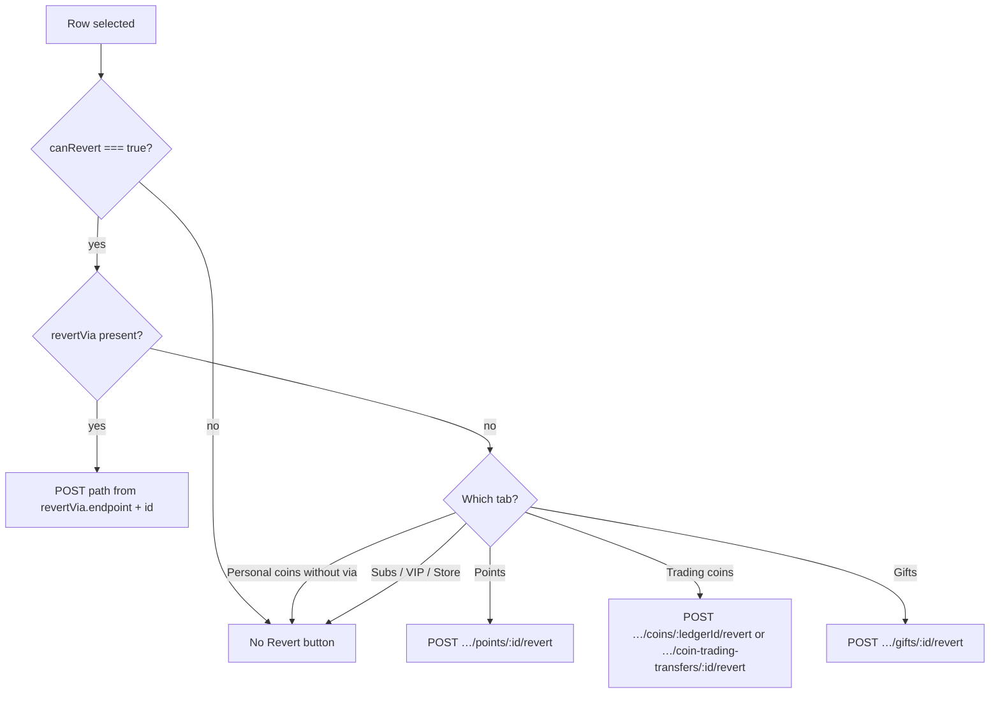

# Admin transaction controls & revert

How the admin panel lists, investigates, and reverts wallet activity — per screen and tab — plus the API rules behind the UI.

**Audience:** operators (what each section does) and developers (routing, endpoints, errors).  
**Auth:** system admin JWT — `Authorization: Bearer <adminAccessToken>`  
**Base:** `{baseUrl}/api/v1/admin`

Related docs:

- View → endpoint catalog: [`ADMIN_VIEWS_AND_ENDPOINTS.md`](./ADMIN_VIEWS_AND_ENDPOINTS.md)
- Backend client guide: `ol-node-rest/docs/ADMIN_TRANSACTIONS_CLIENT_INTEGRATION.md`
- Users / wallet notes: `ol-node-rest/docs/ADMIN_USERS_CLIENT_INTEGRATION.md` (§5)
- Flow: `ol-node-rest/docs/flow-md/admin-transactions-flow.md`

Source of truth in this repo:

| Concern | File |
|---------|------|
| Global explorer | `src/views/TransactionsView.vue` |
| User wallet history | `src/components/user/TransactionTabs.vue` |
| Wallet freeze | `src/components/user/WalletOverview.vue` |
| Revert routing helpers | `src/utils/transactionRevert.ts` |
| Shared revert/list API | `src/api/transactions.ts` |
| Per-user tx + wallet API | `src/api/userAdmin.ts` |

---

## 1. Safety rules (always)

1. **Show Revert only when the API sends `canRevert === true`.** Never invent from `counterpartyId`, gift id, or transfer id alone.
2. On coin / trading-coin ledger rows, prefer **`revertVia`** (`{ endpoint, id }`) for the POST path. Personal COIN is **not** reverted via `POST /transactions/coins/:ledgerEntryId/revert`.
3. `POST /transactions/coins/:ledgerEntryId/revert` is for **TRADING_COIN** peer rows only (`revertVia.endpoint === 'coin_ledger'`).
4. Agent → user personal-coin credits use  
   `POST /transactions/coin-trading-transfers/:transferId/revert` (`revertVia.endpoint === 'coin_trading_transfer'`).
5. Gift undos use `POST /transactions/gifts/:giftTransactionId/revert` (`revertVia.endpoint === 'gift'`, or Gifts tab row id).
6. Every revert requires a **reason** and sends an **idempotencyKey**.
7. Frozen receiver wallets or insufficient balance block revert — see [§5](#5-error-codes--operator-actions).



---

## 2. Screens (operator guide)

### 2.1 Transactions explorer — `TransactionsView`

| | |
|--|--|
| **Route** | `/admin/transactions` |
| **Sidebar** | Transactions |
| **View name** | `TransactionsView` |

Global list across the platform. Use filters (user id, counterparties, date range, `q`) and open a row’s detail drawer. Revert runs from the list/detail when enabled.

#### Tabs

| Tab | What you see | Revert? | Notes |
|-----|----------------|---------|-------|
| **Personal coins** | Personal COIN ledger | Yes, if `canRevert` | Uses **`revertVia`** → gift or trading-transfer POST (never coin ledger) |
| **Points** | Points ledger | Yes, if `canRevert` | In-tab Revert |
| **Trading coins** | All TRADING_COIN ledger rows (top-ups, admin adjust, agent transfer debits). **Credit / debit** filter. Transfer-linked rows include `coinTradingTransfer`. | Yes, if `canRevert` | `revertVia` → `coin_ledger` or `coin_trading_transfer`. Old `?tab=coin-trading-transfers` redirects here. |
| **Gifts** | Gift transactions | Yes, if `canRevert` | In-tab Revert |
| **Subscriptions** | Sub history | No | Investigate only |
| **VIP purchases** | VIP purchase history | No | Investigate only |
| **Store purchases** | Store purchase history | No | Investigate only |

#### Operator checklist

- [ ] Confirm you are on the correct tab for the currency you intend to reverse  
- [ ] Confirm balances / freeze state of the **receiver** (insufficient / frozen → failed revert)  
- [ ] Enter a clear reason (audit trail)  
- [ ] After success, refresh the list; balance should match expectations  

---

### 2.2 User detail wallet — `UserDetailView`

| | |
|--|--|
| **Route** | `/admin/users/:id` |
| **Sidebar** | Companion of Users (`UserListView`) |
| **UI** | `WalletOverview` + `TransactionTabs` |

#### Wallet overview (not ledger revert)

**Freeze / unfreeze** only — these do **not** reverse peer-to-peer gifts or trading transfers. Create / return adjustments are on the **Currency** page.

#### Transaction history tabs

| Tab | List | Revert? | Behaviour |
|-----|------|---------|-----------|
| **Coins** | `GET /users/:id/transactions/coins` | If `canRevert` + `revertVia` (trading-transfer funded) | Follow `revertVia` → transfer POST |
| **Points** | `GET /users/:id/transactions/points` | If `canRevert` | `POST …/points/:id/revert` |
| **Trading** | `GET /users/:id/transactions/trading-coins` | If `canRevert` | Prefer `revertVia` / transfer id; else trading ledger revert. On `NOT_REVERTABLE` + `transferId`, retries once on transfer endpoint. |

Every row has **Open in explorer** → `/admin/transactions?tab=…&q={id}`.

---

### 2.3 Quick decision: “Where do I revert this?”

| Situation | Screen / tab | Control |
|-----------|--------------|---------|
| Points peer movement | Explorer **Points** or user **Points** | Revert |
| Trading-coin peer ledger | Explorer **Trading coins** or user **Trading** | Revert |
| Agent / trading → personal credit | Explorer **Trading coins** (debit row / `coinTradingTransfer`) or personal coins with `revertVia` | Revert |
| Gift send/receive undo | Explorer **Gifts** or personal coins with `revertVia.gift` | Revert |
| Need credit/debit without undoing a peer tx | **Currency** page | Create / return |
| Pause spending | User detail **Wallet overview** | Freeze |

---

## 3. Developer wiring

### 3.1 Explorer routing

`resolveExplorerRevert(tab, entry)` in `src/utils/transactionRevert.ts`:

1. Require `canRevert === true`.
2. If `entry.revertVia` → map endpoint:
   - `coin_ledger` → `revertCoin(id)`
   - `gift` → `revertGift(id)`
   - `coin_trading_transfer` → `revertCoinTradingTransfer(id)`
3. Else tab fallbacks: points / trading-coins / transfers / gifts (personal `coins` without via → null).

`TransactionsView` includes `coins` in `REVERTABLE_TABS` so badge + drawer Revert show when the API marks the row.

### 3.2 User wallet routing

`resolveUserWalletRevert(tab, tx)` — same `canRevert` + optional `revertVia` / `coinTradingTransferId` rules.

### 3.3 Request body

```json
{
  "reason": "Support ticket #1234 — duplicate credit",
  "idempotencyKey": "admin-tx-revert-<kind>-<id>-<timestamp>"
}
```

### 3.4 List endpoints

**Explorer**

```
GET /admin/transactions/coins
GET /admin/transactions/points
GET /admin/transactions/trading-coins
GET /admin/transactions/coin-trading-transfers
GET /admin/transactions/gifts
GET /admin/transactions/subscriptions
GET /admin/transactions/vip-purchases
GET /admin/transactions/store-purchases
```

**User detail**

```
GET /admin/users/:id/transactions/coins
GET /admin/users/:id/transactions/points
GET /admin/users/:id/transactions/trading-coins
GET /admin/users/transactions/filter-types
```

**Revert**

```
POST /admin/transactions/points/:ledgerEntryId/revert
POST /admin/transactions/coins/:ledgerEntryId/revert
POST /admin/transactions/coin-trading-transfers/:transferId/revert
POST /admin/transactions/gifts/:giftTransactionId/revert
```

### 3.5 Remaining gaps vs backend

| Backend | Admin panel |
|---------|-------------|
| Global explorer lists `canRevert` + `revertVia` on personal COIN | **Implemented** — in-tab Revert follows `revertVia` |
| Per-user `GET /users/:id/transactions/*` may omit `canRevert` / `revertVia` | Revert UI is wired; coins tab stays inactive until API adds flags — use **Open in explorer** |
| `UserDetailView` seed includes gift revert POST | Catalog + CSA view seed should include `POST …/gifts/:id/revert` |

---

## 4. Per-view matrix (cheat sheet)

| View | Tab / section | When Revert shows | POST |
|------|---------------|-------------------|------|
| `TransactionsView` | Personal coins | `canRevert` | via `revertVia` → gifts or transfers |
| `TransactionsView` | Points | `canRevert` | `…/points/:id/revert` |
| `TransactionsView` | Trading coins | `canRevert` | `revertVia` → `…/coins/:id/revert` or `…/coin-trading-transfers/:id/revert` |
| `TransactionsView` | Gifts | `canRevert` | `…/gifts/:id/revert` |
| `TransactionsView` | Subs / VIP / Store | never | — |
| `UserDetailView` | Coins history | only if API `canRevert` + via | gift / transfer |
| `UserDetailView` | Points history | `canRevert` | `…/points/:id/revert` |
| `UserDetailView` | Trading history | `canRevert` | transfer if id, else `…/coins/:id/revert` |
| `UserDetailView` | Wallet overview | n/a | add/deduct/freeze (not undo) |

---

## 5. Error codes → operator actions

| Code | HTTP | What it means | What to do |
|------|------|---------------|------------|
| `NOT_REVERTABLE` | 400 | Wrong endpoint or row type | If `details.transferId` → open **Trading coins** and search that id. Else use Gifts / correct tab. |
| `ALREADY_REVERTED` / `TRANSFER_ALREADY_REVERSED` | 409 | Already undone | Stop; refresh list |
| `INSUFFICIENT_COINS` | 402 | Receiver personal coins too low | Ask user to restore coins or use another remediation |
| `INSUFFICIENT_TRADING_COINS` | 402 | Receiver trading balance too low | Same |
| `INSUFFICIENT_POINTS` | 402 | Receiver points too low | Same |
| `PERSONAL_COINS_FROZEN` / `TRADING_COINS_FROZEN` / `POINTS_FROZEN` | 4xx | Receiver wallet frozen | Unfreeze on user wallet (if policy allows), then retry |
| `LEDGER_ENTRY_NOT_FOUND` | 404 | Stale ledger id | Refresh list |
| `TRANSFER_NOT_FOUND` | 404 | Stale transfer id | Refresh Transfers tab |
| `GIFT_TRANSACTION_NOT_FOUND` | 404 | Stale gift id | Refresh Gifts tab |
| `INVALID_REQUEST` | 400 | Missing/invalid reason or body | Fix reason and retry |
| `USER_NOT_FOUND` | 404 | Search/filter user missing | Check id (explorer search) |

Full backend table: `ADMIN_TRANSACTIONS_CLIENT_INTEGRATION.md` §4.6 / §6.

---

## 6. Catalog entries

Endpoints for these flows are listed under:

- **`TransactionsView`** — list + revert routes  
- **`UserDetailView`** — per-user transaction lists, wallet freeze, and shared revert POSTs (including gifts)

in [`ADMIN_VIEWS_AND_ENDPOINTS.md`](./ADMIN_VIEWS_AND_ENDPOINTS.md). Keep that file updated if you add a new revert surface.
